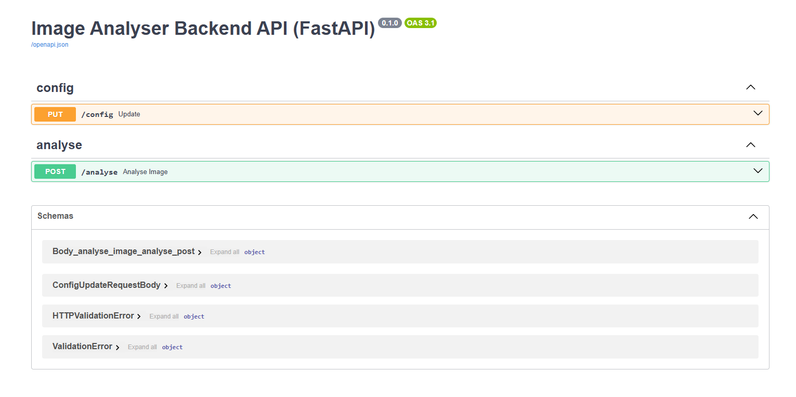

    Author - Nay Oo Kyaw
    Date - 2025-10-30

# Image Analyser – Backend Restful API(FastAPI + YOLOv8 ONNX)
A FastAPI backend that accepts an image upload, runs computer AI vision detection (YOLOv8 ONNX), evaluates simple safety rules (proximity + PPE), and returns a structured risk assessment.

## How to run backend API FastAPI server
`uv sync`
`uv run uvicorn image_analyser_backend.app:app --reload`

## 📁 Output
  
  
  

---
## 🚀 What This Backend Does
- Accepts **JPEG/PNG image uploads**
- Performs **object detection**
  - YOLOv8 ONNX via ONNX Runtime (or mock mode)
- Applies **safety rule engine**
  - PPE detection (helmet/vest)
  - Distance / proximity checks
- Returns:
  - Overall risk level (Low / Medium / High)
  - Detailed rule breaches
  - Optional **annotated preview** (base64)
  - Performance timing + detector config

---
## 🔁 High-Level Flow
1. Client uploads image → `POST /analyse`
2. Input validation: file type & size
3. ONNX detection → `[label, score, bbox]`
4. Rule engine:
   - Reads threshold configs from `rules.yaml` ✅
   - Computes safety risks
5. Returns `AnalysisResult` JSON (+ annotated image optional)

---
## 📁 Project Architecture
| Folder | Responsibility |
|--------|----------------|
| `routers/` | API routing (UploadFile handling, HTTP status codes) |
| `schemas/` | Pydantic models (DTOs: AnalysisResult, Detection, etc.) |
| `services/` | Business orchestration – validation → detect → rules → response |
| `inference/` or `services.detector/` | ONNX Runtime model integration or mock detector |
| `services.rule_engine/` | Configurable safety logic (YAML overrides) |
| `core/` | Settings (pydantic-settings), CORS, constants |
| `utils/` | Helpers (image annotation → base64, etc.) |
| `response_handlers/` | Optional response wrappers (SUCCESS envelope) |
| `tests/` | Pytest suite (AAA - Arrange/Act/Assert) |

## Request Lifecycle
• Router calls `AnalyseService.run_analyse(...)`.

• Service:
  - Reads file bytes, checks content type/size.
  - Loads detector via DetectorFactory (uses Settings for thresholds; falls back to mock if model missing).
  - Runs inference, converts raw outputs to Detection schema.
  - Loads Rule Engine via RuleEngineFactory, which reads `config/rules.yaml` (if present) to override defaults.
  - Computes breaches + overall risk; derives scale (Low/Med/High).
  - Optionally renders annotated image (boxes + rule hints) to base64.
  - Returns `AnalysisResult` (or `Response_SUCCESS[AnalysisResult]` if using the wrapper).

• Errors (e.g., invalid image): `raise HTTPException(status_code=400, detail=...)` so FastAPI returns proper error JSON (and avoids response-model validation issues).

## Configuration Model
• Detector thresholds (affect what is detected):
  - `CONFIDENCE_THRESHOLD`, `IOU_THRESHOLD`, `YOLO_IMGSZ`, `MAX_DETS` in `settings.py` (overridable via `.env`).

• Rule thresholds (affect risk scoring):
  - `config/rules.yaml` → `proximity_threshold`, `missing_ppe_labels`, `weights`.
  - Defaults exist in `settings.py` and are overridden by YAML if present.

